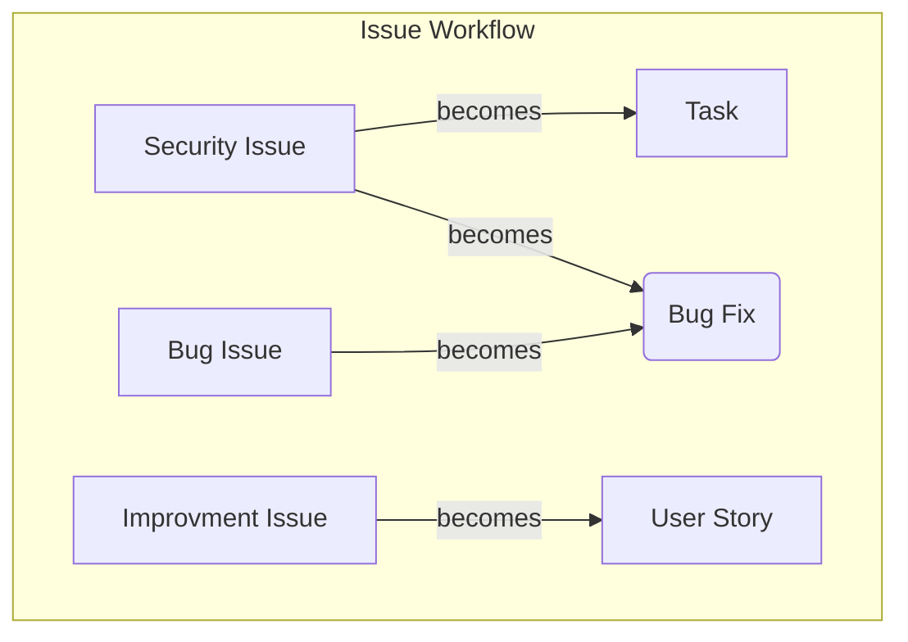
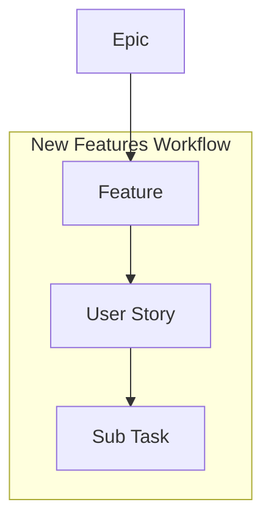
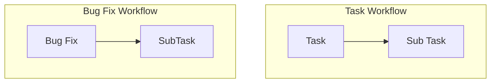

# How to contribute
Please create (in the repository) one of :
- Security Issue (See also the [SECURITY.md](SECURITY.md))
- Improvment Issue
- Bug Issue

Please use the templates when creating a new issue ticket.

After discussing your ticket it will become a Task, User Story or Bug Fix, which get handled by the GitHub Project.

# GitHub Project Workflow

## How to handle features

- **User Stories** are requirements, which directly involve the user
- User Stories are grouped in **Features**
- Features are grouped in **Epics**
- Only User Stories and Tasks get committed to the `main`-branch.

If an existing user story shall be changed, a new user story must be created and the old one must be marked as obsolete.

Subtask and commits on the feature branch are in a 1:1 relation. However, for simplicity SubTasks are optional.

**Sub Tasks** can be single commits on the feature, task, bugfix branch, for example `feature/YYY/XXX-user-story`

## How to handle everything else
To Dos which do not directly add a new feature to the application, are handled as a **Task**.
This can be reuquirements, which do not directly involve the user. (Refactorings, Updating Dependencies, Correcting Spelling, Improve Code quality, Things to improve the development workflow, Security improvments).

A **Bug Fix** is existing application code (a feature/user story), which does not work as expected, and needs to be fixed.

- Bug Fixes and Task get committed to the `main`-branch.

## Branching Strategy

- `feature/YYY/XXX-user-story`
- `task/XXX-things-to-do`
- `bugfix/XXX-problem`
- `release/M.m.p`
  

`XXX` is the ticket number.

feature/bugfix/task branches must be merged via a pull request. All commits must be squashed.

The pull request commit message should be named exactly like the Ticket 

## Commit Workflow
The commit message must be in the following form:

- `Feature(#123): <The user story> (#456)` 
- `Task(#126): <The task to change>`
- `BugFix(#127): <The problem>`

The commitizen tool will use the prefix to create automatically a changelog and will bump the version number.

## Versioning

The versioning happens automatically using commitizen. We use SemVer2 for versioning.

